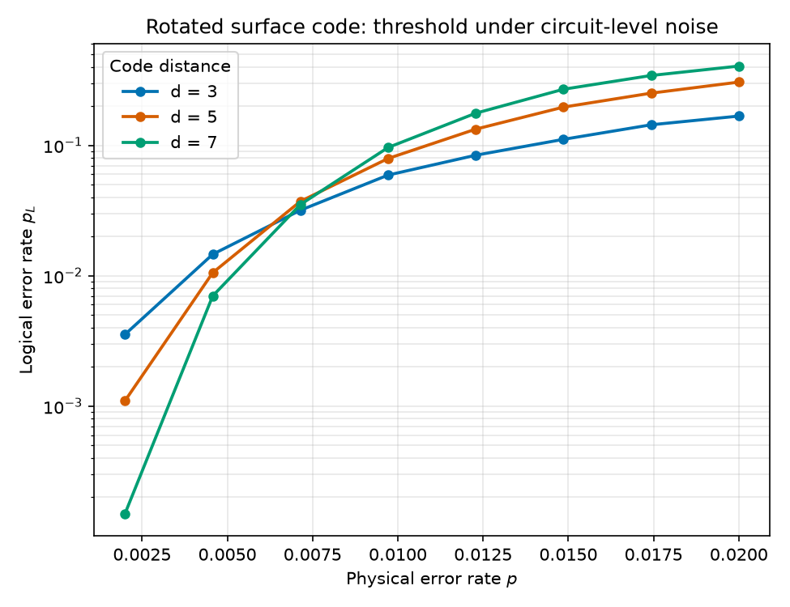

# QuantumErrorThresh

## Objective

Surface-code error correction for fault-tolerant quantum computing that simulates a rotated surface code under circuit-level noise, decodes the syndrome, and extracts the error-correction threshold.

## Tools

Python, Stim, PyMatching, NumPy, Matplotlib.

## Features

The pipeline first constructs a rotated-surface-code memory circuit and its qubit scaling, then decodes the syndrome via minimum-weight perfect matching (MWPM). It sweeps the physical error rate across code distances to locate the threshold, and maps a logical error budget to the required distance, physical-qubit count, and runtime (the FTQC resource layer). Each stage is a standalone notebook: `01_build_circuit`, `02_decode_mwpm`, `03_threshold_sweep`, `04_resource_estimation_link`.

## Results

The d = 3, 5, 7 curves cross near p ≈ 0.6%, the standard value for circuit-level depolarizing noise. Below the crossing, the logical error rate drops with distance (at p = 0.002: d=7 → 1.5×10⁻⁴ vs d=3 → 3.6×10⁻³); above it, the ordering reverses. The threshold is lower than the ~3% phenomenological figure because every gate, reset, and measurement is noisy.

